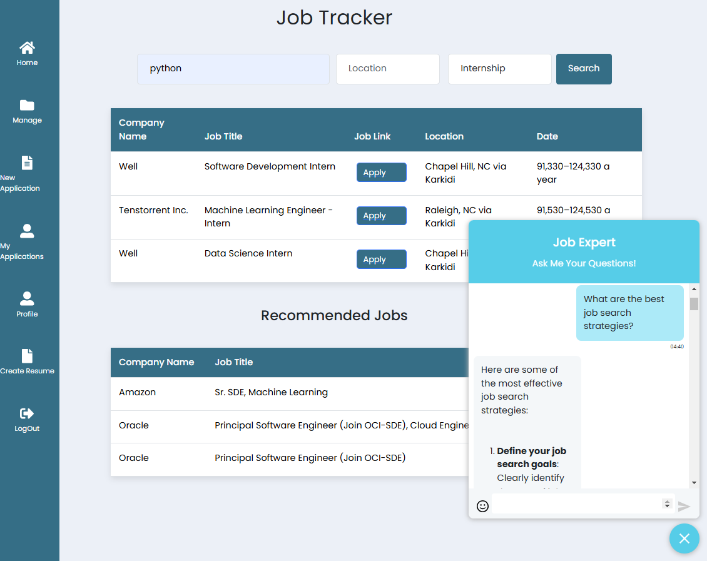

# J-Tracker - Your Job Tracking Assistant

The process of applying for jobs and internships is not a cakewalk. Managing job applications is a time-consuming process. Due to the referrals and deadlines, the entire procedure can be stressful. Our application allows you to track and manage your job application process, as well as regulate it, without the use of cumbersome Excel spreadsheets.

Our application keeps track of the jobs you've added to your wish list. It also keeps track of the companies you've already applied to and keeps a list of any rejections. Rather than having the user browse each company's site for potential prospects, our application allows the applicant to search for them directly using basic keywords. Any prospective work offers can then be added to the applicant's wishlist.

Video: https://www.canva.com/design/DAGXnn0mqe4/Wh2PcCvbZVNBjhWoCMuC4g/watch

## Table of contents

- [Basic Design](#basic-design)
- [Demo Video](#demo-video)
- [Improvements and Feature Additions](https://github.com/asvch/jobtracker?tab=readme-ov-file#improvements-and-feature-additions-fall-2024-csc-510-g56)
- [Future Scope](#future-scope)
- [Technologies Used](#technologies-used)
- [Installation](#installation)
  - [Requirements](#requirements)
  - [Strongly Recommended](#strongly-recommended)
- [Getting Started](#getting-started)
  - [Boot](#boot)
  - [Shutdown](#shutdown)
- [Hosting the Database](#hosting-the-database)
  - [Local MongoDB](#local-mongodb)
  - [Hosted database with MongoDB Atlas](#hosted-database-with-mongodb-atlas)
- [License](#license)
- [How to Contribute](#how-to-contribute)
- [Team Members](#team-members)

## Basic Design

## Demo Video

https://www.canva.com/design/DAGXnn0mqe4/Wh2PcCvbZVNBjhWoCMuC4g/watch

## Improvements and Feature Additions Fall 2024 CSC-510-G56

## 1) A New Home Page:

View your recommended jobs and search for new positions all in one page now! 

## 2) Redesigned Kanban Board:

Now with drag and drop functionality! Drag and drop from column to column and watch the diagram also change with it.

## 3) A New LLM Agent Helper for All Your Questions:

Having issues with your job search? We know it can be frustrating. Ask our LLM expert any questions you have or advice you need! With the click of a button, access this expert from any page on Job Tracker for helpful advice!

## 4) Email Reminders:

Don't forget about that deadline or that interview! When you log an application on the site, send yourself an email to make sure you follow through on the next steps!

## 5) Bug Fixes for Saving Users Information:

Previously, the user information on the profile page could not be updated. But that is now sorted! Update your languages, interests, school, and more in your profile tab!

## Future Scope:

- Fine-tune the LLM bot so it provides better career advice after training.
- Interview Prep Tools: Add features like mock interview simulations and frequently asked questions tailored to job descriptions.
- Add a feature that allows users to attach these reminders to their Google calendar.
- Work on better web scraping so the columns display correct values in the search and recommendations tables.
- Work on a recommender algorithm to more cleverly suggest jobs for each user based on their interests.

## Modules:

1. The Home Page where users can search about the Job Postings along with filters like Job Type and Location, and get recommendation about the jobs according to their preferences. 
2. The ApplicationsPage where users can add and see the position they applied to and can update/delete the the information. Any details in any table can be modified at any time during the process
3. The ProfilePage where user can add his skills, experience level and preffered location. This information is used to recommend user jobs that require similar skillsets.
4. The My Applications page enables users to track all their job applications visually on a Kanban-style board with sections like "Applied," "Rejected," "Waiting for Referrals," and "Wishlist." Additionally, it displays a Sankey chart summarizing the flow of applications across different statuses and categories, providing a visual overview of all bookmarked or applied positions.

## Technologies Used:

- Python
- Node.Js
- Flask
- MongoDB
- React

## Installation:

### Requirements:

- [Python](https://www.python.org/downloads/) (recommended >= 3.8)
- [pip](https://pip.pypa.io/en/stable/installation/) (Latest version 21.3 used as of 11/3)
- [npm](https://nodejs.org/en/) (Latest version 6.14.4 used as of 11/3)

### Strongly Recommended:

- A terminal environment capable of handling bash scripts.

To install all required packages, while within the context of project root directory, run:

./setup.sh

This will handle all npm and pip package installations required for both the front and backend.

If the script says "command not found" or something similar, run chmod +x ./setup.sh. This grants the script execution privileges. Depending on your setup, this may occur for the boot_dockerless files, amongst others. The same command will fix the issue.

## Getting Started:

### Boot:

To run a testing environment, run:

./startup.sh

This will run flask and npm simultaneously, booting both the front and backend. Note - npm takes substantially longer to boot compared to flask.

### Shutdown:

To ensure that flask is no longer occupying a port, run:

./shutdown.sh

This will search for any active process containing "flask" and kill the process.

## Hosting the Database:

### Local MongoDB:

1. Download [MongoDB Community Server](https://docs.mongodb.com/manual/administration/install-community/)
2. Follow the [Installion Guide](https://docs.mongodb.com/guides/server/install/)
3. In app.py set 'host' string to 'localhost'
4. Run the local database:

mongodb

- Recommended: Use a GUI such as [Studio 3T](https://studio3t.com/download/) to more easily interact with the database

### Hosted database with MongoDB Atlas:

1. [Create account](https://account.mongodb.com/account/register) for MongoDB

- **If current MongoDB Atlas owner adds your username/password to the cluster, skip to step 4** \*

2. Follow MongoDB Atlas [Setup Guide](https://docs.atlas.mongodb.com/getting-started/) to create a database collection for hosting applications
3. In app.py set 'host' string to your MongoDB Atlas connection string
4. Create a .env file in the /backend directory with the specifications:

- MONGODB_HOST_STRING: MongoDB Atlas cluster link
- BASE_FRONTEND_URL: The url of the port is it exposed

5. For testing through CI to function as expected, repository secrets will need to be added through the settings. Create individual secrets with the following keys/values:

- MONGODB_HOST_STRING: MongoDB Atlas cluster non-prod link
- BASE_FRONTEND_URL: The url of the port is it exposed

## License

The project is licensed under the [MIT](https://github.com/asvch/jobtracker/blob/project2/LICENSE) license.

## How to Contribute?

Please see our [CONTRIBUTING.md](https://github.com/asvch/jobtracker/blob/project2/Contributing.md) for instructions on how to contribute to the repository and assist us in improving the project.

## Team Members
- Ajay Chundi
- Ruthwik Hosadurga Madhusudhana
- Karan Joshi
